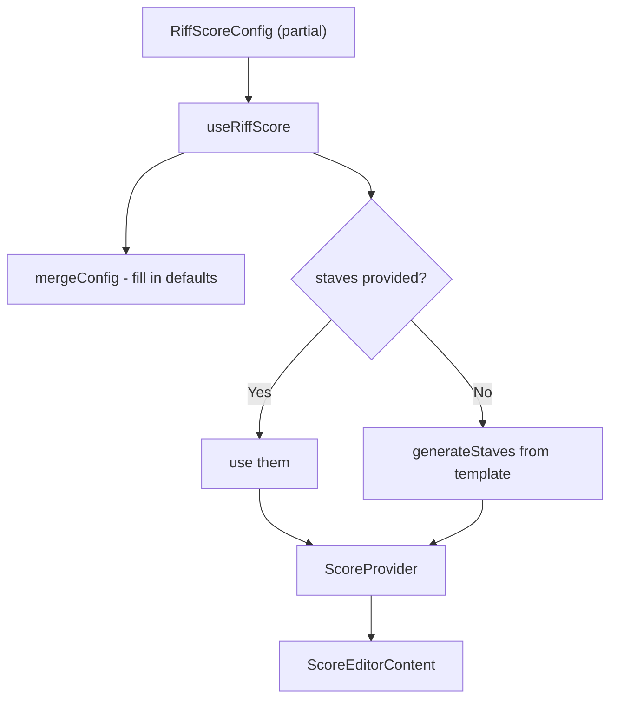
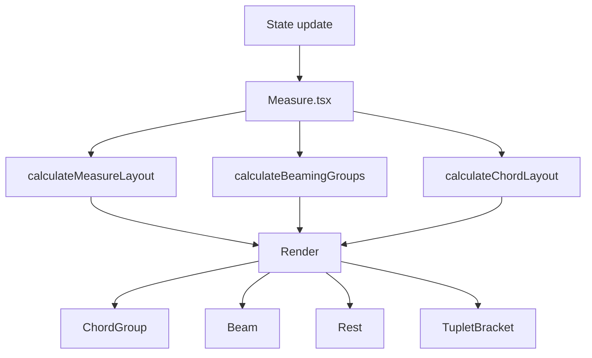

[← Back to README](../README.md)

# RiffScore Architecture Guide

> A configurable, embeddable sheet music editor for React. Focuses on common notation needs and platform independence.

> **See also**: [Configuration Guide](./CONFIGURATION.md) • [Interaction Design](./INTERACTION.md)

---

## 1. Core Principles

These choices shape how the editor works.

<details>
<summary><strong>View principles</strong></summary>

### 🏛️ Single Source of Truth
The `Score` object is the canonical state. Layout details (beam angles, accidental visibility) are calculated at render time, not stored.
*   `Score` is plain JSON—easy to serialize and debug.
*   What you save is what you load.

### ⚡ Command Pattern
All mutations go through `ScoreEngine.dispatch()`.
*   Undo/redo comes for free.
*   Each command is self-contained and logged.

### 🎼 Theory-First Data Model
Pitches are stored as absolute values (e.g., `"F#4"`), not relative to key.
*   `MusicService` handles context—whether an `F#` needs an accidental depends on the key signature, computed at render time.

### 🎨 Standards-Based Notation
Glyphs come from the SMuFL specification, using the Bravura font.
*   No custom SVG paths—just standardized Unicode code points.
*   Swap in any SMuFL-compliant font if you prefer.

### 🔧 Flexibility
One `config` prop controls everything.
*   Override only what you need; sensible defaults handle the rest.
*   Generate blank scores from templates, or pass in existing compositions.

### ✨ Simplicity
`<RiffScore />` works out of the box.
*   No providers to wrap, no context to set up.
*   Playback, MIDI, keyboard shortcuts, and undo/redo are included.

### 🔄 Compatibility
Export to JSON, MusicXML, or ABC notation.
*   MusicXML works with Finale, Sibelius, MuseScore, and others.
*   Import is on the roadmap.

</details>

---

## 2. Entry Point

`<RiffScore />` is the public API. Pass a config to customize, or use defaults.

<details>
<summary><strong>View examples</strong></summary>

```tsx
import { RiffScore } from 'riffscore';

// Defaults: grand staff, 4 measures
<RiffScore />

// Custom config
<RiffScore config={{
  ui: { showToolbar: false, scale: 0.75 },
  interaction: { isEnabled: false },
  score: { staff: 'treble', measureCount: 8, keySignature: 'G' }
}} />
```

### How config is resolved



See [Configuration Guide](./CONFIGURATION.md) for details.

</details>

---

## 3. Directory Structure

Organized in layers: services → engines → hooks → components.

<details>
<summary><strong>View tree</strong></summary>

```
riffscore/
├── src/                      # Library source
│   ├── index.tsx             # Exports RiffScore
│   ├── RiffScore.tsx         # Config wrapper
│   ├── types.ts              # Score, Selection, RiffScoreConfig
│   ├── componentTypes.ts     # Component prop types
│   ├── config.ts             # Layout constants
│   ├── themes.ts             # Theme definitions
│   ├── constants.ts          # Music constants
│
│   ├── components/
│   │   ├── Assets/           # Visual assets (7 files)
│   │   │   ├── BravuraTest.tsx
│   │   │   ├── ClefIcon.tsx
│   │   │   ├── GrandStaffBracket.tsx
│   │   │   ├── NoteIcon.tsx
│   │   │   ├── RestIcon.tsx
│   │   │   ├── TieIcon.tsx
│   │   │   └── semiBreve.svg
│   │   │
│   │   ├── Canvas/           # SVG rendering (13 files)
│   │   │   ├── ScoreCanvas.tsx
│   │   │   ├── ScoreHeader.tsx
│   │   │   ├── Staff.tsx
│   │   │   ├── Measure.tsx
│   │   │   ├── ChordGroup.tsx
│   │   │   ├── Note.tsx
│   │   │   ├── Rest.tsx
│   │   │   ├── Stem.tsx
│   │   │   ├── Flags.tsx
│   │   │   ├── Beam.tsx
│   │   │   ├── Tie.tsx
│   │   │   ├── TupletBracket.tsx
│   │   │   └── GhostPreview.tsx
│   │   │
│   │   ├── Layout/           # Editor layout
│   │   │   ├── ScoreEditor.tsx
│   │   │   ├── ScoreTitleField.tsx
│   │   │   ├── Portal.tsx
│   │   │   └── Overlays/
│   │   │       ├── ConfirmDialog.tsx
│   │   │       └── ShortcutsOverlay.tsx
│   │   │
│   │   └── Toolbar/          # Toolbar controls (17 files)
│   │       ├── Toolbar.tsx
│   │       ├── ToolbarButton.tsx
│   │       ├── Divider.tsx
│   │       ├── PlaybackControls.tsx
│   │       ├── HistoryControls.tsx
│   │       ├── MidiControls.tsx
│   │       ├── FileMenu.tsx
│   │       ├── InstrumentSelector.tsx
│   │       ├── InputModeToggle.tsx
│   │       ├── StaffControls.tsx
│   │       ├── DurationControls.tsx
│   │       ├── ModifierControls.tsx
│   │       ├── AccidentalControls.tsx
│   │       ├── TupletControls.tsx
│   │       ├── MeasureControls.tsx
│   │       ├── MelodyLibrary.tsx
│   │       └── Menus/
│   │           ├── DropdownOverlay.tsx
│   │           ├── ClefOverlay.tsx
│   │           ├── KeySignatureOverlay.tsx
│   │           └── TimeSignatureOverlay.tsx
│
│   ├── services/             # Business logic
│   │   ├── MusicService.ts   # TonalJS wrapper
│   │   └── TimelineService.ts# Playback timing
│
│   ├── engines/
│   │   ├── ScoreEngine.ts    # Command dispatch
│   │   ├── toneEngine.ts     # Audio (Tone.js)
│   │   ├── midiEngine.ts     # MIDI input
│   │   └── layout/           # Layout calculation (8 files)
│   │       ├── index.ts      # Re-exports
│   │       ├── types.ts      # Layout types
│   │       ├── positioning.ts# Pitch → Y
│   │       ├── measure.ts    # Event positions, hit zones
│   │       ├── beaming.ts    # Beam groups
│   │       ├── tuplets.ts    # Tuplet brackets
│   │       ├── stems.ts      # Stem lengths
│   │       └── system.ts     # Multi-staff sync
│
│   ├── commands/             # Undo/redo commands (20 files)
│   │   ├── types.ts
│   │   ├── AddEventCommand.ts
│   │   ├── AddNoteToEventCommand.ts
│   │   ├── ChangePitchCommand.ts
│   │   ├── DeleteEventCommand.ts
│   │   ├── DeleteNoteCommand.ts
│   │   ├── LoadScoreCommand.ts
│   │   ├── MeasureCommands.ts
│   │   ├── RemoveTupletCommand.ts
│   │   ├── SetGrandStaffCommand.ts
│   │   ├── SetKeySignatureCommand.ts
│   │   ├── SetSingleStaffCommand.ts
│   │   ├── SetTimeSignatureCommand.ts
│   │   ├── TogglePickupCommand.ts
│   │   ├── ToggleRestCommand.ts
│   │   ├── TransposeSelectionCommand.ts
│   │   ├── TupletCommands.ts
│   │   ├── UpdateEventCommand.ts
│   │   ├── UpdateNoteCommand.ts
│   │   └── UpdateTitleCommand.ts
│
│   ├── hooks/                # React hooks (29 files)
│   │   ├── handlers/         # Event handler modules
│   │   │   ├── handleMutation.ts
│   │   │   ├── handleNavigation.ts
│   │   │   └── handlePlayback.ts
│   │   │
│   │   ├── useRiffScore.ts
│   │   ├── useScoreLogic.ts
│   │   ├── useScoreEngine.ts
│   │   ├── useScoreInteraction.ts
│   │   ├── useSelection.ts
│   │   ├── useHistory.ts
│   │   ├── useNavigation.ts
│   │   ├── useNoteActions.ts
│   │   ├── useMeasureActions.ts
│   │   ├── useModifiers.ts
│   │   ├── usePlayback.ts
│   │   ├── useMIDI.ts
│   │   ├── useKeyboardShortcuts.ts
│   │   ├── useAutoScroll.ts
│   │   ├── useDragToSelect.ts
│   │   ├── useEditorMode.ts
│   │   ├── useEditorTools.ts
│   │   ├── useExport.ts
│   │   ├── useFocusTrap.ts
│   │   ├── useGrandStaffLayout.ts
│   │   ├── useMeasureInteraction.ts
│   │   ├── useMeasureLayout.ts
│   │   ├── useModifierKeys.ts
│   │   ├── usePreviewRender.ts
│   │   ├── useSamplerStatus.ts
│   │   ├── useTitleEditor.ts
│   │   ├── useTupletActions.ts
│   │   └── useAccidentalContext.ts
│
│   ├── exporters/
│   │   ├── musicXmlExporter.ts
│   │   ├── abcExporter.ts
│   │   └── jsonExporter.ts
│
│   ├── context/
│   │   ├── ScoreContext.tsx
│   │   └── ThemeContext.tsx
│
│   ├── utils/                # Utility functions (10 files)
│   │   ├── core.ts           # Duration math
│   │   ├── generateScore.ts  # Template → staves
│   │   ├── mergeConfig.ts    # Deep merge
│   │   ├── selection.ts      # Selection utilities
│   │   ├── interaction.ts    # Interaction utilities
│   │   ├── validation.ts     # Score validation
│   │   ├── accidentalContext.ts
│   │   ├── commandHelpers.ts
│   │   ├── debug.ts          # Debug logging
│   │   └── focusScore.ts     # Focus management
│
│   ├── data/                 # Static data
│   │   └── melodies.ts       # Sample melodies
│
│   └── __tests__/            # All tests (34 files)
│
├── demo/                     # Demo Next.js app
│   ├── app/
│   │   ├── page.tsx
│   │   └── ConfigMenu.tsx
│   └── ...
│
└── docs/
```

</details>

---

## 4. Data Model

`Score` → `Staff[]` → `Measure[]` → `ScoreEvent[]` → `Note[]`

<details>
<summary><strong>View schema</strong></summary>

```typescript
Score
  ├── title: string
  ├── timeSignature: "4/4"
  ├── keySignature: "G"
  ├── bpm: number
  └── staves: Staff[]
        ├── id: string | number
        ├── clef: 'treble' | 'bass' | 'grand'
        ├── keySignature: string
        └── measures: Measure[]
              ├── id: string | number
              ├── isPickup?: boolean
              └── events: ScoreEvent[]
                    ├── id: string | number
                    ├── duration: "quarter"
                    ├── dotted: boolean
                    ├── isRest?: boolean
                    ├── tuplet?: TupletInfo
                    └── notes: Note[]
                          ├── id: string | number
                          ├── pitch: "F#4" | null
                          ├── accidental?: 'sharp' | 'flat' | 'natural'
                          ├── tied?: boolean
                          └── isRest?: boolean
```

### Selection Model

```typescript
Selection
  ├── staffIndex: number          // 0 for single, 0-1 for Grand Staff
  ├── measureIndex: number | null
  ├── eventId: string | number | null
  ├── noteId: string | number | null
  ├── selectedNotes: Array<{      // Multi-selection support
  │     staffIndex, measureIndex, eventId, noteId
  │   }>
  └── anchor?: { ... } | null     // Range selection anchor
```

### Configuration

```typescript
RiffScoreConfig
  ├── ui: { showToolbar, scale, theme? }
  ├── interaction: { isEnabled, enableKeyboard, enablePlayback }
  └── score: { title, bpm, timeSignature, keySignature, staff?, measureCount?, staves? }
```

</details>

---

## 5. Design Decisions

<details>
<summary><strong>View decisions</strong></summary>

### Notes and Rests are the same type
Both are `ScoreEvent`. Notes have `notes[]`, rests have `isRest: true`. This keeps commands and selection logic unified.

### Grand staff stays in sync
Key signature, time signature, and pickup measures apply to all staves. `Alt + Up/Down` moves between staves.

### Tests are consolidated
All tests live in `__tests__/`. Current coverage: Services 98%, Utils 87%, Commands 79%, Hooks 62%.

</details>

---

## 6. Layout Engine

Eight modules handle positioning and engraving.

<details>
<summary><strong>View modules</strong></summary>

| Module | Purpose |
|--------|---------|
| `index.ts` | Re-exports all layout functions |
| `types.ts` | Layout type definitions |
| `measure.ts` | Event positions, hit zones |
| `system.ts` | Multi-staff sync |
| `positioning.ts` | Pitch → Y coordinate |
| `beaming.ts` | Beam groups and angles |
| `tuplets.ts` | Bracket positions |
| `stems.ts` | Stem lengths |

### Pipeline



</details>

---

## 7. Hooks Reference

<details>
<summary><strong>View hook list</strong></summary>

### State Management

| Hook | Purpose |
|------|---------|
| `useRiffScore` | Config → initial score |
| `useScoreLogic` | Main state orchestration |
| `useScoreEngine` | Command dispatch |
| `useSelection` | Selection state |
| `useHistory` | Undo/redo stack |

### Interaction

| Hook | Purpose |
|------|---------|
| `useNavigation` | Arrow key handling |
| `useNoteActions` | Add/delete notes |
| `useMeasureActions` | Add/delete measures |
| `useModifiers` | Duration, accidentals, ties |
| `useTupletActions` | Tuplet creation/removal |
| `useKeyboardShortcuts` | Global keyboard handler |
| `useScoreInteraction` | Drag/pitch operations |
| `useMeasureInteraction` | Hit zone detection |
| `useDragToSelect` | Lasso selection |

### Playback & Input

| Hook | Purpose |
|------|---------|
| `usePlayback` | Play/pause control |
| `useMIDI` | MIDI input handling |
| `useSamplerStatus` | Piano sample loading |

### Layout & Rendering

| Hook | Purpose |
|------|---------|
| `useAutoScroll` | Auto-scroll during playback |
| `useGrandStaffLayout` | Grand staff sync |
| `useMeasureLayout` | Measure layout calculation |
| `usePreviewRender` | Ghost note rendering |
| `useAccidentalContext` | Accidental visibility |

### UI Support

| Hook | Purpose |
|------|---------|
| `useEditorMode` | Note/rest mode toggle |
| `useEditorTools` | Tool orchestration |
| `useExport` | Export functionality |
| `useFocusTrap` | Toolbar focus management |
| `useModifierKeys` | Cmd/Ctrl key tracking |
| `useTitleEditor` | Title editing |

### Handler Modules (`hooks/handlers/`)

| Handler | Purpose |
|---------|---------|
| `handleMutation` | Accidentals, ties, transposition, delete |
| `handleNavigation` | Arrow key navigation |
| `handlePlayback` | Space bar playback toggle |

</details>

---

## 8. Command Reference

<details>
<summary><strong>View commands</strong></summary>

| Command | Purpose |
|---------|---------|
| `AddEventCommand` | Insert note/rest at position |
| `AddNoteToEventCommand` | Add note to chord |
| `ChangePitchCommand` | Change single note pitch |
| `DeleteEventCommand` | Remove entire event |
| `DeleteNoteCommand` | Remove note from chord |
| `LoadScoreCommand` | Load complete score |
| `MeasureCommands` | Add/delete measures |
| `RemoveTupletCommand` | Remove tuplet grouping |
| `SetGrandStaffCommand` | Switch to grand staff |
| `SetSingleStaffCommand` | Switch to single staff |
| `SetKeySignatureCommand` | Change key signature |
| `SetTimeSignatureCommand` | Change time signature |
| `TogglePickupCommand` | Toggle pickup measure |
| `ToggleRestCommand` | Convert note↔rest |
| `TransposeSelectionCommand` | Transpose selected notes |
| `TupletCommands` | Create tuplet groups |
| `UpdateEventCommand` | Update event properties |
| `UpdateNoteCommand` | Update note properties |
| `UpdateTitleCommand` | Change score title |

</details>

---

## 9. Dependencies

<details>
<summary><strong>View packages</strong></summary>

| Package | Purpose |
|---------|---------|
| [tonal](https://github.com/tonaljs/tonal) | Music theory |
| [tone](https://tonejs.github.io/) | Audio synthesis |
| react | UI framework |
| lucide-react | Icons |
| Bravura | SMuFL font |

</details>
