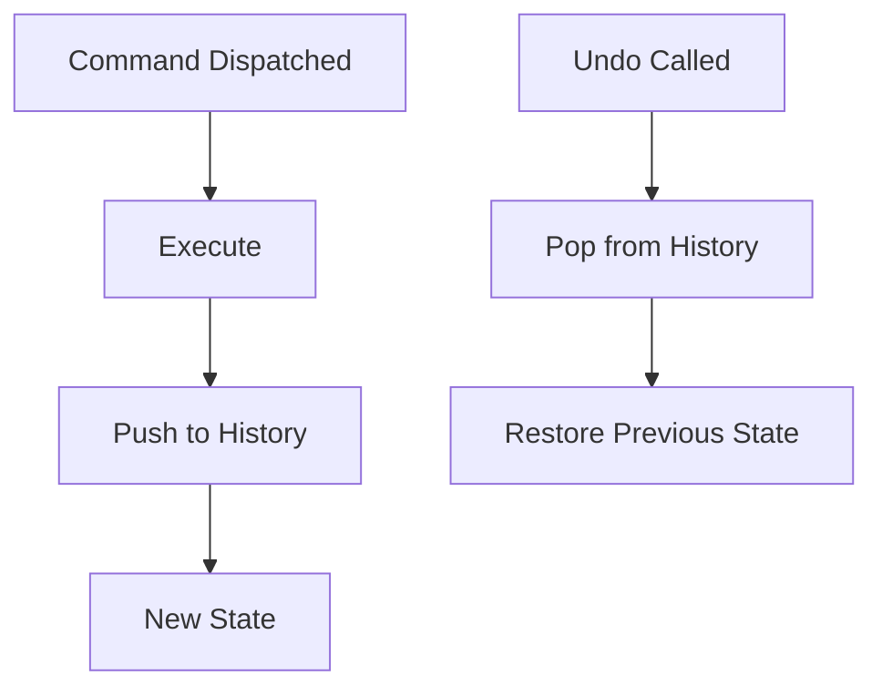

[← Back to README](../README.md) • [Architecture](./ARCHITECTURE.md)

# RiffScore Command Pattern

> Guide to the Command pattern used for all score and selection mutations.

> **See also**: [Architecture](./ARCHITECTURE.md) • [Data Model](./DATA_MODEL.md) • [Testing](./TESTING.md) • [Coding Patterns](./CODING_PATTERNS.md)

---

## 1. Overview

RiffScore uses the **Command pattern** for all state mutations:

```typescript
interface Command {
  type: string;
  execute(state: State, context: Context): State;
}
```

Commands are **pure functions**: they take state in, return new state out, with no side effects.

---

## 2. Command Types

### Score Commands

Modify the `Score` object (notes, measures, key signatures, etc.):

| Command | Purpose |
|---------|---------|
| `AddEventCommand` | Insert note/rest at position |
| `AddNoteToEventCommand` | Add note to chord |
| `ChangePitchCommand` | Change single note pitch |
| `ChromaticTransposeCommand` | Chromatic transposition by semitones |
| `DeleteEventCommand` | Remove entire event |
| `DeleteNoteCommand` | Remove note from chord |
| `TransposeSelectionCommand` | Diatonic transposition by steps |
| `UpdateEventCommand` | Update event properties |
| `UpdateNoteCommand` | Update note properties |
| `LoadScoreCommand` | Load complete score |
| `SetKeySignatureCommand` | Change key signature |
| `SetTimeSignatureCommand` | Change time signature |
| `SetClefCommand` | Change staff clef |
| `MeasureCommands` | Add/delete measures |
| `TupletCommands` | Create tuplet groups |
| `ToggleRestCommand` | Convert note↔rest |
| `TogglePickupCommand` | Toggle pickup measure |

### Selection Commands

Modify the `Selection` object (cursor, multi-select, range):

| Command | Purpose |
|---------|---------|
| `SelectEventCommand` | Select a note/event |
| `ClearSelectionCommand` | Clear all selection |
| `RangeSelectCommand` | Select range between anchor and focus |
| `ExtendSelectionVerticallyCommand` | Vertical expand/contract |
| `SelectAllCommand` | Progressive scope expansion |
| `SelectAllInEventCommand` | Select all notes in chord |
| `SelectMeasureCommand` | Select all in measure |
| `LassoSelectCommand` | Multi-select by bounding box |
| `ToggleNoteCommand` | Toggle note in multi-selection |
| `NavigateCommand` | Move cursor |
| `SetSelectionCommand` | Raw state replacement |

---

## 3. Command Dispatch

### ScoreEngine

Handles score mutations with full undo/redo:

```typescript
import { ScoreEngine } from './engines/ScoreEngine';

const engine = new ScoreEngine(initialScore);

// Dispatch a command
engine.dispatch(new AddEventCommand({
  staffIndex: 0,
  measureIndex: 0,
  pitch: 'C4',
  duration: 'quarter'
}));

// Get new state
const newScore = engine.getState();

// Undo/Redo
engine.undo();
engine.redo();
```

### SelectionEngine

Handles selection changes (no undo history by default):

```typescript
import { SelectionEngine } from './engines/SelectionEngine';

const engine = new SelectionEngine(initialSelection);

engine.dispatch(new SelectEventCommand({
  staffIndex: 0,
  measureIndex: 0,
  eventId: 'e1',
  noteId: 'n1'
}));
```

---

## 4. Creating New Commands

### Step 1: Define the Command

```typescript
// src/commands/MyNewCommand.ts
import type { Command } from './types';
import type { Score } from '../types';

interface MyNewCommandOptions {
  // Command-specific options
}

export class MyNewCommand implements Command {
  readonly type = 'MY_NEW_COMMAND';
  
  constructor(private options: MyNewCommandOptions) {}
  
  execute(state: Score, _context: unknown): Score {
    // Return new state (immutable)
    return {
      ...state,
      // modifications
    };
  }
}
```

### Step 2: Export from Index

```typescript
// src/commands/index.ts
export { MyNewCommand } from './MyNewCommand';
```

### Step 3: Add Tests

```typescript
// src/__tests__/MyNewCommand.test.ts
import { MyNewCommand } from '../commands/MyNewCommand';

describe('MyNewCommand', () => {
  it('should do the thing', () => {
    const result = new MyNewCommand({ ... }).execute(initialState, {});
    expect(result).toMatchObject({ ... });
  });
});
```

---

## 5. Command Best Practices

### Immutability

Always return new objects; never mutate input:

```typescript
// ✅ Good
return { ...state, title: 'New Title' };

// ❌ Bad
state.title = 'New Title';
return state;
```

### Single Responsibility

Each command does one thing:

```typescript
// ✅ Good: Separate commands
AddNoteCommand
TransposeCommand

// ❌ Bad: Combined command
AddAndTransposeCommand
```

### Validation

Validate inputs and return unchanged state for invalid operations:

```typescript
execute(state: Score): Score {
  if (this.measureIndex >= state.staves[0].measures.length) {
    return state;  // No-op for invalid input
  }
  // ... proceed with mutation
}
```

---

## 6. Undo/Redo Integration

Score commands automatically support undo/redo via ScoreEngine's history stack:



Selection commands are ephemeral by default (no history).

---

## 7. Key Files

| File | Purpose |
|------|---------|
| `src/engines/ScoreEngine.ts` | Score command dispatch + history |
| `src/engines/SelectionEngine.ts` | Selection command dispatch |
| `src/commands/types.ts` | Command interface |
| `src/commands/` | All score commands |
| `src/commands/selection/` | All selection commands |

---

[← Back to README](../README.md)
