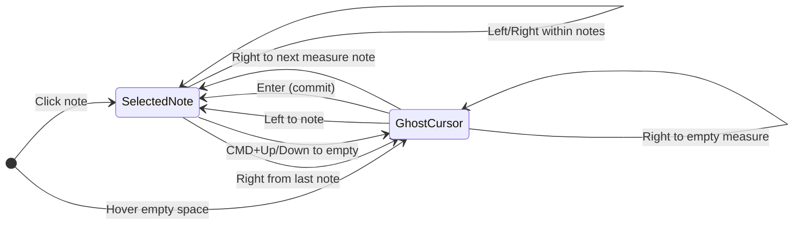
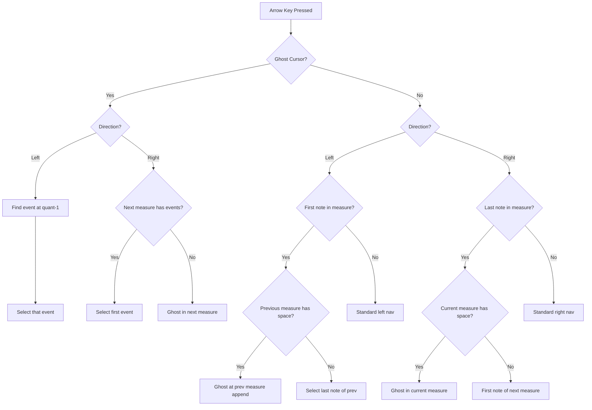
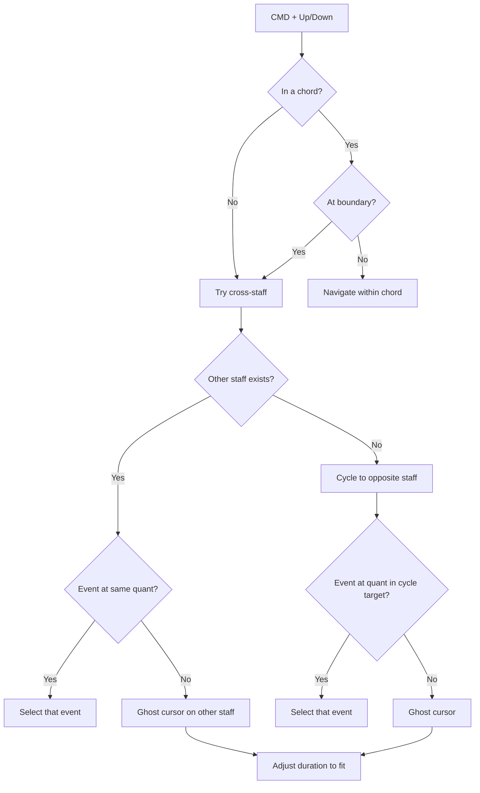
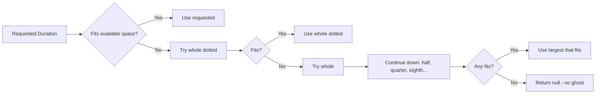
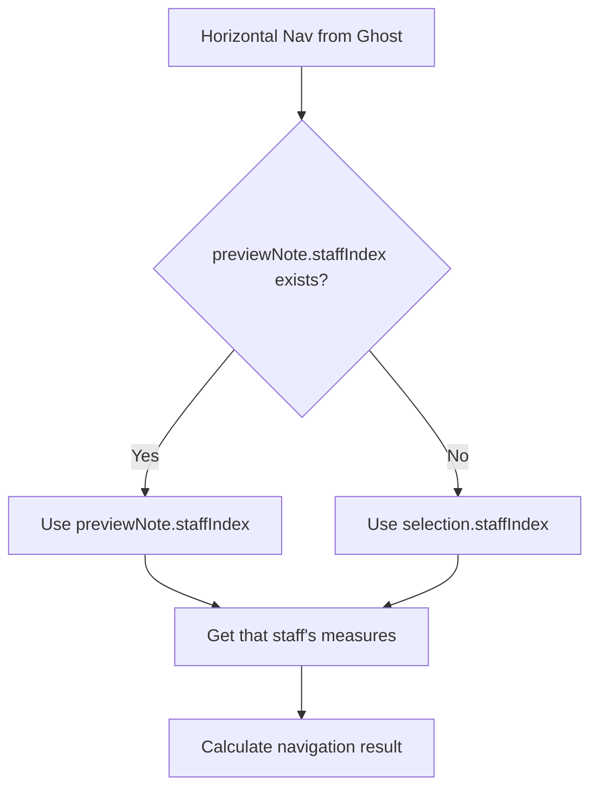

[← Back to Interaction Design](./INTERACTION.md)

# Keyboard Navigation Deep Dive

> Detailed technical documentation for the keyboard navigation system in RiffScore.

---

## 1. State Model

Navigation operates on two key pieces of state that together define "where" the user is in the score:

### Selection State

The `selection` object tracks what is currently selected:

| Property | Type | Description |
|----------|------|-------------|
| `staffIndex` | `number` | Which staff (0 = treble, 1 = bass in grand staff) |
| `measureIndex` | `number \| null` | Which measure (null when at ghost cursor) |
| `eventId` | `string \| null` | Selected event ID (null when at ghost cursor) |
| `noteId` | `string \| null` | Selected note within chord |

### Ghost Cursor State

The `previewNote` object defines the ghost cursor position:

| Property | Type | Description |
|----------|------|-------------|
| `staffIndex` | `number` | Ghost cursor's staff |
| `measureIndex` | `number` | Ghost cursor's measure |
| `quant` | `number` | Position in quants within measure |
| `pitch` | `string` | Preview pitch (e.g., "C4") |
| `duration` | `string` | Duration name (auto-adjusted to fit) |
| `dotted` | `boolean` | Whether dotted |
| `mode` | `string` | "APPEND" for end-of-measure |

**Ghost cursor detection**: `selection.eventId === null && selection.measureIndex === null`

---

## 2. Horizontal Navigation Flow

### Left Arrow Behavior

| From | Condition | Result |
|------|-----------|--------|
| Ghost cursor | Event exists to left | Select that event |
| Ghost cursor | No event to left, prev measure exists | Ghost/note in previous measure |
| First note | Previous measure has space | Ghost cursor at append position |
| First note | Previous measure is full | Select last note of previous |
| Middle note | — | Select previous event |

### Right Arrow Behavior

| From | Condition | Result |
|------|-----------|--------|
| Ghost cursor | Next measure has events | Select first event |
| Ghost cursor | Next measure empty | Ghost in next measure |
| Last note | Current measure has space | Ghost cursor with adjusted duration |
| Last note | Current measure full | First note of next measure |
| Middle note | — | Select next event |

---

## 3. Vertical Navigation Flow

### Chord Navigation

When multiple notes exist at the same rhythmic position (a chord):

- **Up**: Select next higher note in chord
- **Down**: Select next lower note in chord
- At chord boundary: proceeds to cross-staff navigation

### Cross-Staff Navigation

When at chord boundary or on a single note:

1. Calculate target staff (up = staffIndex - 1, down = staffIndex + 1)
2. Look for event at same quant position in target staff
3. If found: select that event's appropriate note
4. If not found: create ghost cursor with adjusted duration

### Staff Cycling

When at the edge staff (top or bottom):

- **Up from top staff**: Cycle to bottom staff at same quant
- **Down from bottom staff**: Cycle to top staff at same quant

---

## 4. Duration Auto-Adjustment

Whenever a ghost cursor is created, `getAdjustedDuration()` ensures it fits:

**Duration order**: whole → half → quarter → eighth → sixteenth → thirtysecond  
**For each**: dotted version tried first, then non-dotted

---

## 5. Staff Context Resolution

When navigating from a ghost cursor, the system must determine which staff's data to use:

This is critical after vertical navigation places a ghost on a different staff.

---

## 6. Key Implementation Files

| File | Function | Responsibility |
|------|----------|----------------|
| [useNavigation.ts](../src/hooks/useNavigation.ts) | `moveSelection()` | Orchestrates navigation, determines active staff |
| [interaction.ts](../src/utils/interaction.ts) | `calculateNextSelection()` | Horizontal navigation logic |
| [interaction.ts](../src/utils/interaction.ts) | `calculateVerticalNavigation()` | Vertical navigation and cross-staff logic |
| [interaction.ts](../src/utils/interaction.ts) | `getAdjustedDuration()` | Finds largest duration that fits space |
| [interaction.ts](../src/utils/interaction.ts) | `getAppendPreviewNote()` | Creates ghost cursor at append position |
| [core.ts](../src/utils/core.ts) | `navigateSelection()` | Low-level event-to-event navigation |

---

## 7. Helper Functions

### `getDefaultPitchForClef(clef)`

Returns default pitch when creating ghost cursor on a staff:
- **Treble**: `C4` (middle C)
- **Bass**: `C3` (octave below middle C)

### `findEventAtQuantPosition(measure, targetQuant)`

Finds an event that overlaps a given quant position in a measure.

### `selectNoteInEventByDirection(event, direction)`

Selects the entry-point note within a chord for cross-staff navigation:
- **Up**: Lowest note (to continue upward from)
- **Down**: Highest note (to continue downward from)

### `calculateTotalQuants(events)`

Sums the quant values of all events in a measure to determine used space.

---

## 8. Edge Cases

### Single-Staff Scores

- Vertical navigation cannot cycle (no other staff exists)
- Guard prevents infinite loops when trying to switch staffs

### Empty Measures

- Left/Right from ghost creates ghost in adjacent empty measure
- Duration auto-adjusts to fill available space

### Full Measures

- Right from last note goes to first note of next measure
- Left from first note goes to last note of previous measure

### Stale State Prevention

- Ghost cursor's `previewNote.staffIndex` is always used for determining staff context
- `previewNote.quant` determines exact position for left navigation
- Selection state cleared (`measureIndex: null`, `eventId: null`) when at ghost

---

[← Back to Interaction Design](./INTERACTION.md)
