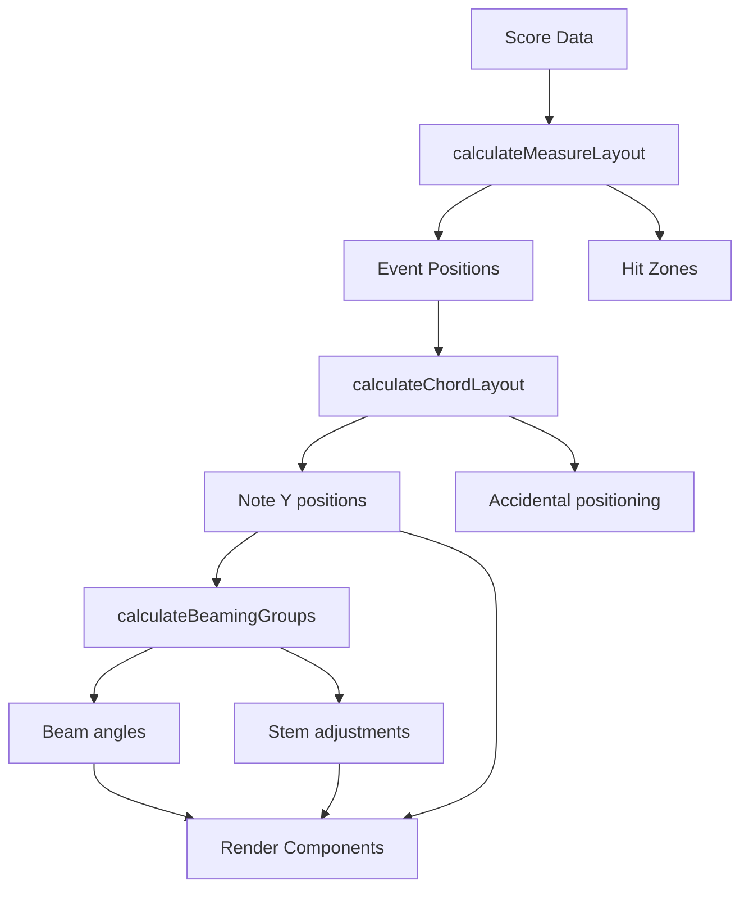

[← Back to README](../README.md) • [Architecture](./ARCHITECTURE.md)

# RiffScore Layout Engine

> Deep dive into the engraving and positioning system.

> **See also**: [Architecture](./ARCHITECTURE.md) • [Data Model](./DATA_MODEL.md)

---

## 1. Overview

The layout engine transforms **Score data** into **visual coordinates** for SVG rendering. It consists of 8 modules in `src/engines/layout/`:

| Module | Purpose |
|--------|---------|
| `index.ts` | Re-exports all layout functions |
| `types.ts` | Layout type definitions |
| `positioning.ts` | Pitch → Y coordinate mapping |
| `measure.ts` | Event positions, hit zones |
| `beaming.ts` | Beam groups and angles |
| `tuplets.ts` | Tuplet bracket positioning |
| `stems.ts` | Stem lengths and directions |
| `system.ts` | Multi-staff synchronization |

---

## 2. Pitch to Y Coordinate

The `positioning.ts` module maps MIDI pitches to vertical positions:

```
Y = baseY - (stepsFromMiddleC * halfLineSpacing)
```

### Staff Lines

| Line | Treble | Bass |
|------|--------|------|
| 5th line | F5 | A3 |
| 4th line | D5 | F3 |
| 3rd line | B4 | D3 |
| 2nd line | G4 | B2 |
| 1st line | E4 | G2 |

### Ledger Lines

Notes beyond the staff receive ledger lines. The layout calculates:
- Number of ledger lines needed
- Position above or below staff
- Correct spacing

---

## 3. Measure Layout

The `measure.ts` module calculates horizontal positioning:

### Quant System

- **96 quants** per whole note
- Quarter note = 24 quants
- Eighth note = 12 quants
- Sixteenth = 6 quants

### Hit Zones

Each rhythmic position has an invisible "hit zone" for click detection:

```
|-----|-----|-----|-----|  Hit zones
  q1    q2    q3    q4    Quarter beats
```

### Event Positioning

```typescript
calculateMeasureLayout(measure, config) → {
  eventPositions: Map<eventId, { x, width }>
  hitZones: Array<{ startQuant, endQuant, x, width }>
}
```

---

## 4. Beaming

The `beaming.ts` module groups notes for beaming:

### Grouping Rules

1. Notes within the same beat are beamed together
2. Notes across barlines are not beamed
3. Rests break beam groups
4. Beam direction follows majority stem direction

### Beam Angle

```
angle = atan2(lastNoteY - firstNoteY, lastNoteX - firstNoteX)
```

Clamped to reasonable angles to avoid extreme slopes.

---

## 5. Stem Direction

The `stems.ts` module determines stem direction:

### Single Notes

- Notes on or above middle line: stems **down**
- Notes below middle line: stems **up**

### Chords

- Direction follows the **extreme note** furthest from middle line
- If equidistant: stems **down**

### Stem Length

- Standard: 3.5 staff spaces
- Extended for beam groups
- Shortened for notes with many ledger lines

---

## 6. Tuplet Brackets

The `tuplets.ts` module positions tuplet brackets:

### Bracket Placement

- Above/below based on stem direction
- Horizontal line with number (e.g., "3" for triplet)
- Slightly curved or angled for visual flow

### Calculations

```typescript
calculateTupletBracket(events) → {
  startX, endX,
  y,
  number: numNotes,
  side: 'above' | 'below'
}
```

---

## 7. Multi-Staff Synchronization

The `system.ts` module aligns staves:

### Grand Staff Layout

- Treble and bass clefs share the same horizontal timeline
- Measure widths are synchronized
- Bar lines extend across both staves

### Brace Positioning

- Grand staff brace spans both staves
- Positioned at the left edge
- Height matches combined staff height

---

## 8. Layout Pipeline



---

## 9. Key Functions

| Function | File | Purpose |
|----------|------|---------|
| `calculateMeasureLayout` | measure.ts | Event X positions |
| `calculateChordLayout` | measure.ts | Note Y + accidentals |
| `calculateBeamingGroups` | beaming.ts | Group notes for beaming |
| `calculateStemDirection` | stems.ts | Up or down |
| `calculateTupletBracket` | tuplets.ts | Bracket positioning |
| `pitchToY` | positioning.ts | Pitch → Y coordinate |

---

[← Back to README](../README.md)
