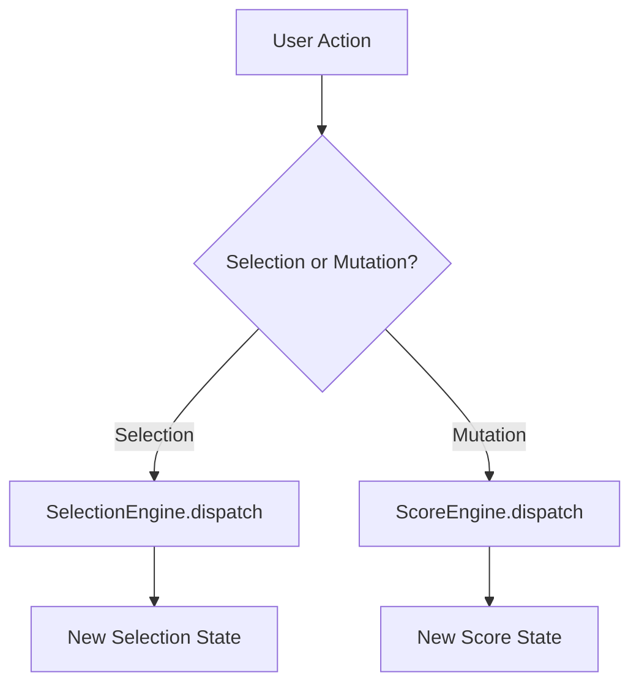

[← Back to README](../README.md)

# RiffScore Selection Model

> Comprehensive guide to selection mechanics, multi-selection patterns, and the 2D selection box model.

> **See also**: [Keyboard Navigation](./KEYBOARD_NAVIGATION.md) • [Commands](./COMMANDS.md) • [Data Model](./DATA_MODEL.md)

---

## 1. Selection State

The `Selection` object tracks the current editing focus:

```typescript
Selection {
  staffIndex: number           // Active staff (0 = treble, 1 = bass)
  measureIndex: number | null  // null when at ghost cursor
  eventId: string | null       // Selected event
  noteId: string | null        // Selected note within chord
  selectedNotes: SelectedNote[] // Multi-selection array
  anchor?: SelectedNote | null // Range selection anchor
  verticalAnchors?: {          // Vertical extension state
    direction: 'up' | 'down'
    sliceAnchors: Record<time, SelectedNote>
    originSelection: SelectedNote[]
  }
}
```

### Key States

| State | Detection | Meaning |
|-------|-----------|---------|
| **Ghost Cursor** | `eventId === null` | Ready to insert new note |
| **Single Selection** | `selectedNotes.length === 1` | One note highlighted |
| **Multi-Selection** | `selectedNotes.length > 1` | Multiple notes selected |
| **Range Active** | `anchor !== null` | Shift+navigation in progress |

---

## 2. Selection Patterns

### Click Selection

| Action | Result |
|--------|--------|
| Click note | Select that note |
| Cmd+Click | Toggle note in multi-selection |
| Shift+Click | Select range from anchor |
| Click empty space | Place ghost cursor |

### Keyboard Selection

| Shortcut | Behavior |
|----------|----------|
| `←` / `→` | Move cursor/selection horizontally |
| `Shift + ←/→` | Extend selection horizontally |
| `Cmd + Shift + ↑/↓` | Extend selection vertically |
| `Cmd + A` | Progressive scope expansion |
| `Esc` | Clear selection |

### Lasso (Drag) Selection

Click and drag on empty space to create a rectangular selection area. All notes within the rectangle are selected.

---

## 3. Anchor-Based Selection

Both horizontal and vertical selection use an **anchor-based** model:

```
Anchor ←————→ Cursor
   ^              ^
   Fixed point    Movable endpoint
```

- **Anchor**: Set on first Shift+navigation
- **Cursor**: Moves with each subsequent navigation
- **Range**: All notes between anchor and cursor are selected

### Horizontal Anchor

Created by Shift+Left/Right. Selects events in timeline order.

### Vertical Anchors

Created by Cmd+Shift+Up/Down. Each time slice maintains an independent anchor:

```
Time 0:    [Anchor: G4] ←→ [Cursor: C3]
Time 96:   [Anchor: E4] ←→ [Cursor: G2]
```

This allows extending multiple chords simultaneously while maintaining predictable expand/contract behavior.

---

## 4. The 2D Selection Box

Vertical selection treats the score as a 2D grid:

### Axes

- **X (Time)**: `measureIndex × 100000 + quantPosition`
- **Y (Vertical Metric)**: `(100 - staffIndex) × 1000 + midiPitch`

### Vertical Metric Examples

| Note | Staff | MIDI | Metric |
|------|-------|------|--------|
| G4 (treble) | 0 | 67 | 100,067 |
| C4 (treble) | 0 | 60 | 100,060 |
| C3 (bass) | 1 | 48 | 99,048 |
| C2 (bass) | 1 | 36 | 99,036 |

This ensures all treble notes are "above" all bass notes, and within each staff, higher pitches have higher values.

---

## 5. Selection Commands

| Command | Trigger | Purpose |
|---------|---------|---------|
| `SelectEventCommand` | Click | Select single note/event |
| `RangeSelectCommand` | Shift+Click | Select range to clicked note |
| `ToggleNoteCommand` | Cmd+Click | Add/remove from multi-selection |
| `SelectAllInEventCommand` | Click chord body | Select all notes in chord |
| `ExtendSelectionVerticallyCommand` | Cmd+Shift+↑/↓ | Vertical expand/contract |
| `SelectAllCommand` | Cmd+A | Progressive scope expansion |
| `SelectMeasureCommand` | Double-click measure | Select all in measure |
| `LassoSelectCommand` | Drag | Select by rectangle |
| `ClearSelectionCommand` | Esc | Clear all selection |

---

## 6. SelectionEngine

Selection state is managed by a dedicated engine, separate from the `ScoreEngine`:



### Why Separate?

- **No Undo for Selection**: Cursor movement shouldn't pollute undo history
- **Ephemeral State**: Selection is transient, score is persistent
- **Independent History**: Enable future "selection undo" if needed

---

## 7. Key Implementation Files

| File | Purpose |
|------|---------|
| [SelectionEngine.ts](../src/engines/SelectionEngine.ts) | State management |
| [selection/](../src/commands/selection/) | All selection commands |
| [verticalStack.ts](../src/utils/verticalStack.ts) | Vertical metrics & stacks |
| [selection.ts](../src/utils/selection.ts) | Selection utilities |

---

[← Back to README](../README.md)
