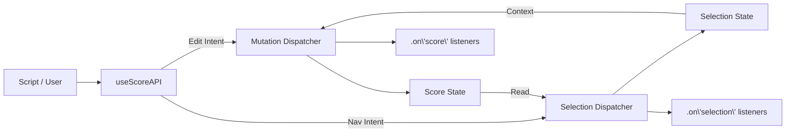

# Analysis: Machine-Addressable Interaction Model

**Date:** 2025-12-19 (Updated: Round 2 Spiral)
**Status:** Approved for Implementation
**References:** `selection_model_brainstorm.md`, `api_reference_draft.md`, `implementation_plan.md`

---

## 1. Executive Summary

This document evaluates architectural options for exposing RiffScore's editing capabilities to external scripts. It recommends a **Glue Layer** architecture backed by a **Dual Dispatcher** (Mutation + Selection) system. The design supports **Multi-Instance** environments, ensures **Synchronous State** for reliable API chaining, and includes **Event Subscriptions** for reactive integrations.

---

## 2. Design Goals

### 2.1. Machine-Addressable Interface
External scripts require an API optimized for **intent** and **readability**.

| Feature | Internal Command | External API |
| :--- | :--- | :--- |
| **Identity** | Explicit UUIDs | Auto-generated |
| **Context** | Absolute indices | "At cursor" |
| **Verbosity** | High | Low (sensible defaults) |
| **Error Handling** | Throws | No-op / Log |

### 2.2. Multi-Instance Support (Registry)
```typescript
interface RiffScoreRegistry {
  instances: Map<string, MusicEditorAPI>;
  get(id: string): MusicEditorAPI | undefined;
  active: MusicEditorAPI | null;
}
```

### 2.3. Synchronous State Requirement
Both engines update state synchronously; React's async render is decoupled.

### 2.4. Event-Driven Integration
External systems can react to changes via `api.on('score', callback)`.

---

## 3. Alternative Approaches Evaluated

| Option | Description | Verdict |
| :--- | :--- | :--- |
| **A: Direct Command Exposure** | Expose `dispatch` and Command classes | ❌ REJECTED – Too verbose, brittle |
| **B: Glue Layer** | Facade hook with intent-based methods | ✅ ACCEPTED |

---

## 4. The Cursor-Centric Model

**Decision: Shared Cursor**
The API operates on the **Main Application Selection**. Users see what scripts are doing (ideal for tutorials).

---

## 5. API Surface (11 Categories)

| # | Category | Methods |
| :--- | :--- | :--- |
| 1 | **Nav** | `move`, `jump`, `select`, `selectAtQuant`, `selectById` |
| 2 | **Selection** | `addToSelection`, `selectRangeTo`, `selectAll`, `deselectAll` |
| 3 | **Entry** | `addNote`, `addRest`, `addTone`, `makeTuplet`, `toggleTie`, `setInputMode` |
| 4 | **Modify** | `setPitch`, `setDuration`, `setAccidental`, `transpose`, `transposeDiatonic`, `updateEvent` |
| 5 | **Structure** | `addMeasure`, `deleteMeasure`, `deleteSelected`, `setKeySignature`, `setMeasurePickup` |
| 6 | **Config** | `setClef`, `setScoreTitle`, `setBpm`, `setTheme`, `setScale`, `setStaffLayout` |
| 7 | **Lifecycle** | `loadScore`, `reset`, `export('json' | 'abc' | 'musicxml')` |
| 8 | **Playback** | `play`, `pause`, `stop`, `rewind`, `setInstrument` |
| 9 | **Data** | `getScore`, `getConfig`, `getSelection` |
| 10 | **History** | `undo`, `redo`, `beginTransaction`, `commitTransaction` |
| 11 | **Events** | `on('score')`, `on('selection')`, `on('playback')` |

---

## 6. Internal Architecture: Dual Dispatchers

| Dispatcher | State | History | Commands |
| :--- | :--- | :--- | :--- |
| **Mutation** | `Score` | Full Undo/Redo | `AddEventCommand`, `TransposeCommand` |
| **Selection** | `Selection` | Ephemeral | `SelectEventCommand`, `NavigateCommand` |

### 6.1. Architecture Diagram (with Events)


---

## 7. Performance Considerations

### 7.1. Layout Thrashing Risk
A script running 100 operations in a tight loop could trigger 100 re-renders.

**Mitigation: Transaction Batching**
```javascript
api.beginTransaction();
for (let i = 0; i < 100; i++) {
  api.addNote(`C${i % 5 + 3}`, 'eighth');
}
api.commitTransaction(); // Single render + single undo step
```

### 7.2. Implementation
-   `ScoreEngine` enters "batch mode" on `beginTransaction()`.
-   Listeners are suppressed until `commitTransaction()`.
-   A batched command is pushed to history as a single entry.

---

## 8. Risk Mitigation

| Risk | Mitigation |
| :--- | :--- |
| **API Contract Breakage** | Versioned API (`v1.0.0-draft`); stability tests. |
| **Stale Cursor State** | Synchronous engine refs; React state is secondary. |
| **Multi-Instance Collision** | Registry with unique IDs; cleanup on unmount. |
| **Performance Degradation** | Transaction batching; lazy notification. |

---

## 9. Implementation Roadmap

| Phase | Scope |
| :--- | :--- |
| **0** | Type Definitions (`MusicEditorAPI`, `RiffScoreRegistry`) |
| **1** | Glue Layer (`useScoreAPI`) + Registry in `RiffScore.tsx` |
| **2** | Selection Engine + Commands |
| **3** | Event Subscriptions |
| **4** | Interaction Refactor (Deferred) |

See `implementation_plan.md` for detailed file changes.

---

## 10. Conclusion

The **Glue Layer + Dual Dispatcher + Registry + Events** architecture provides a robust, scalable, performant foundation for machine-addressable interaction. It cleanly separates mutation from navigation, supports multiple instances, enables reactive integrations, and mitigates performance risks through batching.
