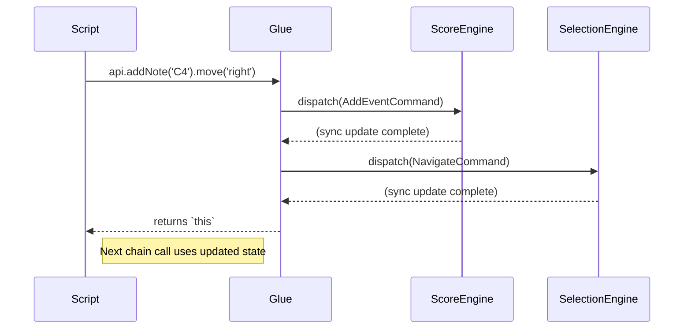
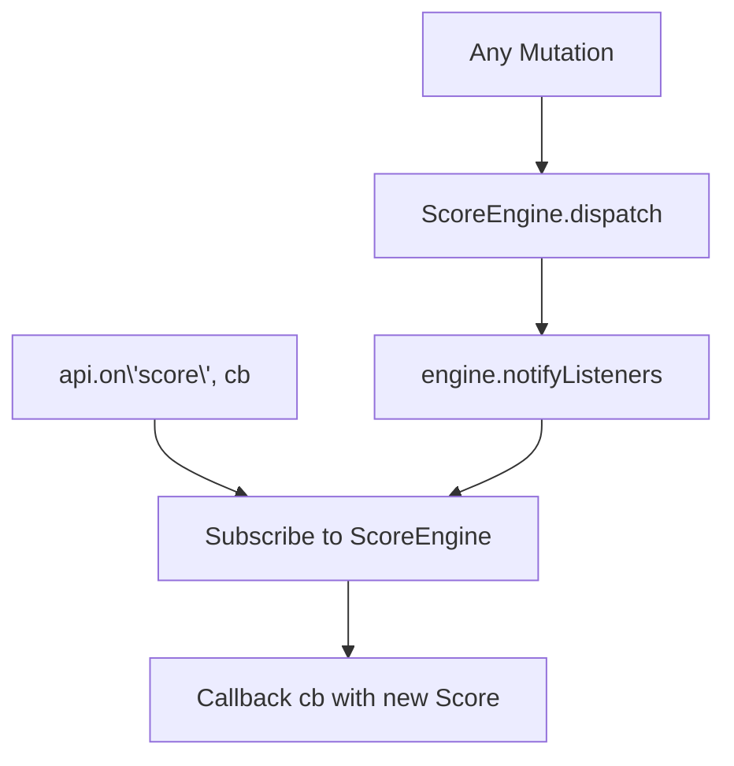

# Brainstorming: Selection Command/Dispatch Model

**Date:** 2025-12-19 (Updated: Round 2 Spiral)
**Context:** Consolidated design notes on Command/Dispatch architecture, Glue Layer, and Machine-Addressable API. Fully aligned with `api_reference_draft.md`, `interaction_model_analysis.md`, and `implementation_plan.md`.

---

## 1. Problem Statement

RiffScore manages **Score Mutations** via a robust `ScoreEngine.dispatch(Command)` pattern. However, **Selection/Navigation** is still managed via React `useState` and scattered utility functions in `interaction.ts`. This asymmetry creates friction when exposing a unified API.

**Key Insight:** Scripts need to navigate *and* mutate seamlessly:
```javascript
api.select(1).addNote('C4').move('right').addNote('D4');
```
This chaining requirement demands that Selection become as formally managed as Mutations.

---

## 2. Core Design Patterns

### 2.1. The "Glue Layer" (`useScoreAPI`)
A translation layer between high-level script intents and low-level Commands.

**Responsibilities:**
| Task | Description |
| :--- | :--- |
| **ID Generation** | Scripts never mint UUIDs; the Glue does. |
| **Cursor Context** | "At current cursor" is resolved internally. |
| **Chainability** | All mutation/navigation methods return `this`. |
| **Validation** | Invalid inputs are no-ops or gracefully handled. |
| **Routing** | Directs calls to `ScoreEngine` (mutations) or `SelectionEngine` (navigation). |

### 2.2. Multi-Instance Registry
`window.riffScore` is a **Registry**, not a single API instance.

```typescript
interface RiffScoreRegistry {
  instances: Map<string, MusicEditorAPI>;
  get(id: string): MusicEditorAPI | undefined;
  active: MusicEditorAPI | null;
}
```

**Lifecycle:**
-   Mount: `window.riffScore.instances.set(id, api); window.riffScore.active = api;`
-   Unmount: `window.riffScore.instances.delete(id);`

### 2.3. Synchronous State Engines
For chaining to work, both `ScoreEngine` and `SelectionEngine` must update their internal state **synchronously**. React's async render cycle is decoupled; the authoritative state lives in the Engines' refs.



---

## 3. Event Subscription Flow

The API exposes `on(event, callback)` for external listeners. This is backed by the subscriber patterns in both engines.



**Supported Events:**
-   `'score'`: Score mutations, undo/redo, load.
-   `'selection'`: Cursor moves, selection range changes.
-   `'playback'`: Play/pause/stop, measure progress.

---

## 4. API Categories (Full List)

| # | Category | Example Methods |
| :--- | :--- | :--- |
| 1 | Navigation | `move`, `jump`, `select`, `selectAtQuant` |
| 2 | Selection | `addToSelection`, `selectRangeTo`, `selectAll` |
| 3 | Entry | `addNote`, `addRest`, `addTone`, `makeTuplet` |
| 4 | Modification | `setPitch`, `setDuration`, `transpose`, `transposeDiatonic` |
| 5 | Structure | `addMeasure`, `deleteMeasure`, `setKeySignature` |
| 6 | Config | `setTheme`, `setScale`, `setBpm`, `setClef` |
| 7 | Lifecycle | `loadScore`, `reset`, `export` |
| 8 | Playback | `play`, `pause`, `stop`, `setInstrument` |
| 9 | Data | `getScore`, `getConfig`, `getSelection` |
| 10 | History | `undo`, `redo`, `beginTransaction` |
| 11 | Events | `on('score')`, `on('selection')`, `on('playback')` |

---

## 5. Internal Architecture: Dual Dispatchers

| Dispatcher | State Owned | History | Example Commands |
| :--- | :--- | :--- | :--- |
| **Mutation** (`ScoreEngine`) | `Score` | Full Undo/Redo | `AddEventCommand`, `TransposeCommand` |
| **Selection** (`SelectionEngine`) | `Selection` | Ephemeral | `SelectEventCommand`, `NavigateCommand` |

Both are consumed by `useScoreAPI`, which routes calls appropriately based on the method category.

---

## 6. Status

All design work is complete. See `implementation_plan.md` for the phased rollout.
